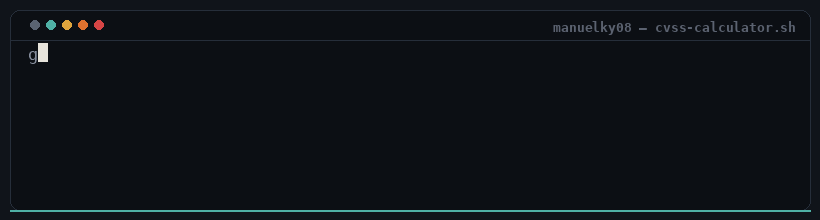

<div align="center">



# CVSS v3.1 Severity & Bounty Calculator

Kalkulator CVSS Base Score standar FIRST.org, dipetakan langsung ke estimasi bounty **$1 – $10.000**.

</div>

---

## Tentang

Tool statis (HTML/CSS/JS murni, tanpa build step, tanpa dependency runtime) untuk menghitung **CVSS v3.1 Base Score** dari delapan metrik resmi, lalu menerjemahkannya jadi:

- **Skor 0.0 – 10.0** + vector string (`CVSS:3.1/AV:.../AC:.../...`)
- **Severity**: None / Low / Medium / High / Critical
- **Estimasi bounty**, dipetakan bertingkat sesuai severity — meniru struktur payout program bug bounty nyata, bukan sekadar `score * 1000`.

Terinspirasi dari [Shopify CVSS Calculator](https://shopify.github.io/appsec/cvss_calculator/), dibangun ulang dari nol dengan tampilan sendiri.

## Preview

| Metrik | Bounty band |
|---|---|
| None | `$0` |
| Low (0.1 – 3.9) | `$1 – $150` |
| Medium (4.0 – 6.9) | `$150 – $1.000` |
| High (7.0 – 8.9) | `$1.000 – $5.000` |
| Critical (9.0 – 10.0) | `$5.000 – $10.000` |

Posisi bounty di dalam band dihitung proporsional terhadap posisi skor di dalam rentang severity-nya — makin dekat ke batas atas severity, makin dekat juga ke batas atas band bounty-nya.

## Fitur

- Implementasi rumus **CVSS v3.1 Base Score** resmi (Exploitability + Impact Sub-Score, termasuk cabang Scope Changed), sudah diuji cocok dengan beberapa vector referensi resmi FIRST.org.
- Vector string live-update + tombol **Copy vector**.
- Severity meter & bounty bar dengan marker posisi otomatis.
- Segmented control per metrik (bukan dropdown) supaya semua opsi langsung kelihatan.
- Tooltip kontekstual: hover/focus tiap opsi buat lihat penjelasan singkatnya.
- Fully responsif, keyboard-accessible (`aria-pressed`, visible focus ring), menghormati `prefers-reduced-motion`.
- Tanpa framework, tanpa build tool — tinggal buka `index.html`.

## Struktur file

```
.
├── index.html    # markup + struktur metrik & panel hasil
├── styles.css    # semua styling (tema dark, mono/sans type system)
├── script.js     # mesin skor CVSS 3.1 + logika UI
├── README.md
└── assets/
    └── manuelky08-cvss-banner.gif
```

## Cara pakai

Tidak perlu instalasi apa pun:

1. Download / clone ketiga file (`index.html`, `styles.css`, `script.js`) dalam satu folder yang sama.
2. Buka `index.html` langsung di browser — atau serve lewat static server kalau mau, misalnya:

   ```bash
   npx serve .
   # atau
   python3 -m http.server 8000
   ```

3. Klik metrik AV / AC / PR / UI / S / C / I / A sesuai kondisi vulnerability. Skor, severity, vector string, dan estimasi bounty ter-update otomatis.

## Catatan

Angka bounty di tool ini bersifat **indikatif**, bukan output resmi dari spesifikasi CVSS — CVSS sendiri tidak mendefinisikan nilai uang. Untuk laporan formal, tetap rujuk ke [dokumen spesifikasi CVSS v3.1](https://www.first.org/cvss/v3.1/specification-document) dari FIRST.org.

---

<div align="center">
<sub>Dibuat oleh <b>manuelky08</b></sub>
</div>
